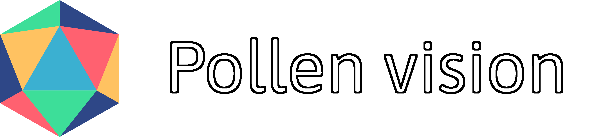

<p align="center" width="50%">
    
</p>
<p align="center">
<b>Simple and unified interface to computer vision models curated for robotics use cases.</b>
</p>

<div align="center">

  <a target="_blank" href="https://huggingface.co/spaces/pollen-robotics/pollen-vision-demo"></a>
  <a target="_blank" href="https://drive.google.com/drive/folders/1Xx42Pk4exkS95iyD-5arHIYQLXyRWTXw?usp=drive_link"></a>
  <a href="https://github.com/pollen-robotics/pollen-vision/blob/main/LICENSE">
    
  </a>
  <a href="https://github.com/psf/black"></a>
  <a href=""></a>
</div>


<!-- # Pollen Vision -->

<div align="center">
 


</div>

## Get started in very few lines of code!
```python
from pollen_vision.vision_models.object_detection import OwlVitWrapper
from pollen_vision.vision_models.object_segmentation import MobileSamWrapper
from pollen_vision.vision_models.utils import Annotator, get_bboxes

owl = OwlVitWrapper()
sam = MobileSamWrapper()
annotator = Annotator()

im = ...
predictions = owl.infer(im, ["paper cups"])  # zero-shot object detection
bboxes = get_bboxes(predictions)

masks = sam.infer(im, bboxes=bboxes)  # zero-shot object segmentation
annotated_im = annotator.annotate(im, predictions, masks=masks)
```
<p align="center">
    
</p>

<details>
<summary>Supported models</summary>

We continue to work on adding new models that could be useful for robotics perception applications. Right now, we support : 

#### Object detection
- `Owl-Vit` for zero-shot object detection and localization
- `Recognize-Anything` for zero-shot object detection (without localization)

#### Object segmentation
- `Mobile-SAM` for (fast) zero-shot object segmentation

Below is an example of combining `Owl-Vit` and `Mobile-Sam` to detect and segment objects in a point cloud, all live. 
(Note: in this example, there is no temporal or spatial filtering of any kind, we display the raw outputs of the models computed independently on each frame)

https://github.com/pollen-robotics/pollen-vision/assets/6552564/a5285627-9cba-4af5-aafb-6af3d1e6d40c


We also provide wrappers for the Luxonis cameras which we use internally. They allow to easily access the main features that are interesting to our robotics applications (RBG-D, onboard h264 encoding and onboard stereo rectification).
</details>

<details>
<summary>Installation</summary>

# Installation

```
Note: This package has only been tested on Ubuntu 22.04.
```

Install everything in "production" mode:
```console
pip install pollen_vision[all]
```

OR Install only the modules you want: 
```console
pip install pollen_vision[depthai_wrapper]
pip install pollen_vision[vision]
```

## Dev mode

Clone this repo, then :

```console
pip install -e .[all]
```

Add "dev" mode dependencies (CI/CD, testing, etc):
```console
pip install -e .[dev]
```

## Vision models specific installation information
To use [RAM](https://github.com/pollen-robotics/recognize-anything), you need to manually [download](https://huggingface.co/xinyu1205/recognize-anything-plus-model/blob/main/ram_plus_swin_large_14m.pth) the checkpoint and place it in `pollen_vision/checkpoints/`

## Luxonis depthai specific information

If this is the first time you use luxonis cameras on this computer, you need to setup the udev rules:
```
echo 'SUBSYSTEM=="usb", ATTRS{idVendor}=="03e7", MODE="0666"' | sudo tee /etc/udev/rules.d/80-movidius.rules
sudo udevadm control --reload-rules && sudo udevadm trigger
```
</details>

<details>
<summary>Examples</summary>
    
# Examples

## Vision models wrappers
Check our [example notebooks](examples/vision_models_examples/)!

## Luxonis depthai wrappers
Check our [example scripts](examples/camera_wrappers_examples/)!

</details>


[](https://twitter.com/pollenrobotics)
[](https://www.linkedin.com/company/pollen-robotics/mycompany/)


