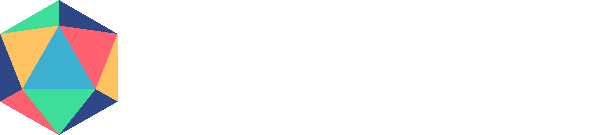

<!-- <p align="center" width="50%">
    
</p> -->

<p align="center" width="50%">
  <picture>
    <source media="(prefers-color-scheme: dark)" srcset="assets/pollen_vision_logo.png">
    <source media="(prefers-color-scheme: light)" srcset="assets/pollen_vision_logo_light_theme.png">
    
  </picture>
  <br/>
  <br/>
</p>

<p align="center">
<b>Simple and unified interface to zero-shot computer vision models curated for robotics use cases.</b>
</p>

<div align="center">

  <a target="_blank" href="https://huggingface.co/spaces/pollen-robotics/pollen-vision-demo"></a>
  <a target="_blank" href="https://drive.google.com/drive/folders/1Xx42Pk4exkS95iyD-5arHIYQLXyRWTXw?usp=drive_link"></a>
  <a href="https://github.com/pollen-robotics/pollen-vision/blob/main/LICENSE">
    
  </a>
  <a href="https://github.com/psf/black"></a>
  <a href=""></a>
</div>


<!-- # Pollen Vision -->

<div align="center">
 


</div>

Check out our [HuggingFace space](https://huggingface.co/pollen-robotics) for an online demo or try pollen-vision in a [Colab notebook](https://drive.google.com/drive/folders/1Xx42Pk4exkS95iyD-5arHIYQLXyRWTXw?usp=drive_link)!

## Get started in very few lines of code!
Perform zero-shot object detection and segmentation on a live video stream from your webcam with the following code:
```python
import cv2

from pollen_vision.vision_models.object_detection import OwlVitWrapper
from pollen_vision.vision_models.object_segmentation import MobileSamWrapper
from pollen_vision.perception.utils import Annotator, get_bboxes


owl = OwlVitWrapper()
sam = MobileSamWrapper()
annotator = Annotator()

cap = cv2.VideoCapture(0)

while True:
    ret, frame = cap.read()
    predictions = owl.infer(
        frame, ["paper cups"]
    )  # zero-shot object detection | put your classes here
    bboxes = get_bboxes(predictions)

    masks = sam.infer(frame, bboxes=bboxes)  # zero-shot object segmentation
    annotated_frame = annotator.annotate(frame, predictions, masks=masks)

    cv2.imshow("frame", annotated_frame)
    if cv2.waitKey(1) & 0xFF == ord("q"):
        cv2.destroyAllWindows()
        break
```
<p align="center">
    
</p>

<details>
<summary>Supported models</summary>

We continue to work on adding new models that could be useful for robotics perception applications.

We chose to focus on zero-shot models to make it easier to use and deploy. Zero-shot models can recognize objects or segment them based on text queries, without needing to be fine-tuned on annotated datasets.

Right now, we support: 
#### Object detection
- `Yolo-World` for zero-shot object detection and localization
- `Owl-Vit` for zero-shot object detection and localization
- `Recognize-Anything` for zero-shot object detection (without localization)

#### Object segmentation
- `Mobile-SAM` for (fast) zero-shot object segmentation

#### Monocular depth estimation
- `Depth Anything` for (non metric) monocular depth estimation

Below is an example of combining `Owl-Vit` and `Mobile-Sam` to detect and segment objects in a point cloud, all live. 
(Note: in this example, there is no temporal or spatial filtering of any kind, we display the raw outputs of the models computed independently on each frame)

https://github.com/pollen-robotics/pollen-vision/assets/6552564/a5285627-9cba-4af5-aafb-6af3d1e6d40c


We also provide wrappers for the Luxonis cameras which we use internally. They allow to easily access the main features that are interesting to our robotics applications (RBG-D, onboard h264 encoding and onboard stereo rectification).
</details>

<details>
<summary>Installation</summary>

# Installation

```
Note: This package has been tested on Ubuntu 22.04 and macOS (with M1 Pro processor).
```
## Git LFS
This repository uses Git LFS to store large files. You need to install it before cloning the repository.

### Ubuntu
```console
sudo apt-get install git-lfs
```

### macOS
```console
brew install git-lfs
```

## One line installation
You can install the package directly from the repository without having to clone it first with:
```console
pip install "pollen-vision[vision] @ git+https://github.com/pollen-robotics/pollen-vision.git@main"
```

> Note: here we install the package with the `vision` extra, which includes the vision models. You can also install the `depthai_wrapper` extra to use the Luxonis depthai wrappers.

## Install from source
Clone this repository and then install the package either in "production" mode or "dev" mode.

>👉 We recommend using a virtual environment to avoid conflicts with other packages.

After cloning the repository, you can either install everything with:
```console
pip install .[all]
```
or install only the modules you want:
```console
pip install .[depthai_wrapper]
pip install .[vision]
```
To add "dev" mode dependencies (CI/CD, testing, etc):
```console
pip install -e .[dev]
```

## Luxonis depthai specific information

If this is the first time you use luxonis cameras on this computer, you need to setup the udev rules:
```
echo 'SUBSYSTEM=="usb", ATTRS{idVendor}=="03e7", MODE="0666"' | sudo tee /etc/udev/rules.d/80-movidius.rules
sudo udevadm control --reload-rules && sudo udevadm trigger
```
</details>

<details>
<summary>Gradio demo</summary>

# Gradio demo
## Test the demo online
A gradio demo is available on Pollen Robotics' [Huggingface space](https://huggingface.co/spaces/pollen-robotics/pollen-vision-demo). It allows to test the models on your own images without having to install anything.

## Run the demo locally
If you want to run the demo locally, you can install the dependencies with the following command:
```console
pip install pollen_vision[gradio]
```

You can then run the demo locally on your machine with:
```console
python pollen-vision/gradio/app.py
```


</details>

<details>

<summary>Examples</summary>
    
# Examples

## Vision models wrappers
Check our [example notebooks](examples/vision_models_examples/)!

## Luxonis depthai wrappers
Check our [example scripts](examples/camera_wrappers_examples/)!

</details>


[](https://twitter.com/pollenrobotics)
[](https://www.linkedin.com/company/pollen-robotics/mycompany/)


