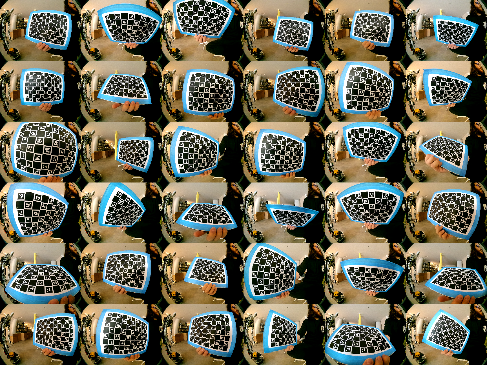

# Calibration procedure

## Dependencies

You will need to install Pollen's multical fork. Follow instructions here https://github.com/pollen-robotics/multical

## First, build yourself a charuco calibration board

Generate a charuco board with the following command:

```console
$ python3 generate_board.py
```

Print it on a A4 paper and place it on a flat surface (we use a wooden board)

Mesure as accurately as possible the size of the squares and the size of the markers and edit the `example_boards/pollen_charuco.yaml` file in the previously cloned `multical` repo to report the values you measured (must be in meters).

## Then, get some images.

Run: 
```console
$ python3 acquire.py --config CONFIG_??
```

(`CONFIG_??` is the name of the config file you want to use, it must be in `pollen_vision/config_files/`. Dont set the `--config` argument to see available config files)

Press `return` to save a pair of images in `./calib_images/` (by default, use `--imagesPath` to change this).

Try to cover a maximum of the field of view, with the board in a variety of orientations. If the coverage is good, about 30 images is sufficient.
Also, make sure that most of the board is visible by all the cameras for all the saved images pairs.

Below is an example of good coverage:



## Then, run multical 

```console
$ cd <...>/multical
$ multical calibrate --image_path <absolute_path_to_calib_images_dir> --boards example_boards/pollen_charuco.yaml --isFisheye <True/False>
```

(For some reason, --image_path must be an absolute path, relative paths don't work)

/!\ Don't forget to set `--isFisheye` to `True` if you are using fisheye lenses /!\

It will write a `calibration.json` file in `<path_to_calib_images_dir>`.

## Then, flash the calibration to the EEPROM

Run:
```console
$ python3 flash.py --config CONFIG_?? --calib_json_file <path to calibration.json>
```

A backup file with the current calibration settings stored on the device will be produced in case you need to revert back. 

If needed, run:
```console
$ python3 restore_calibration_backup.py --calib_file CALIBRATION_BACKUP_<...>.json  
```

## Finally, check the calibration

Run:
```console
$ python3 check_epilines.py --config CONFIG_??
```
And show the aruco board to the cameras.

An `AVG SLOPE SCORE` below `0.1%` is OK.

Ideally it could be under `0.05%`.

The lower, the better

